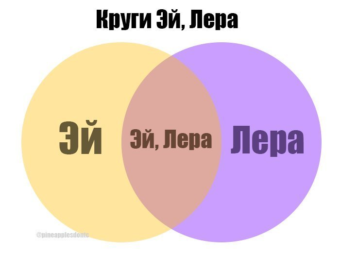
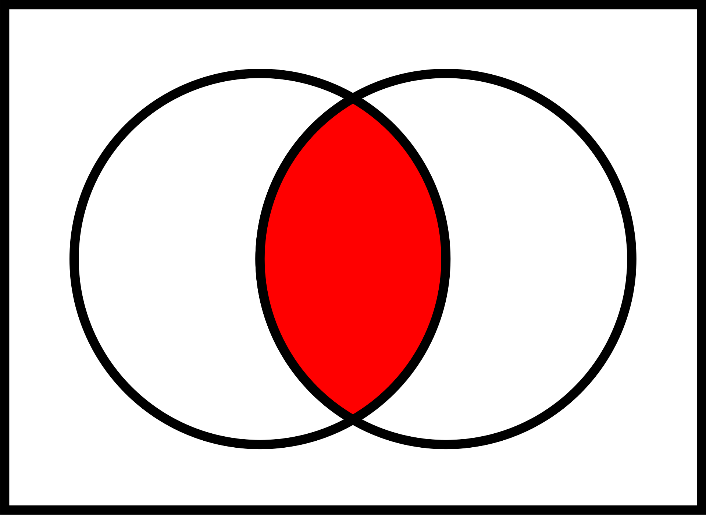
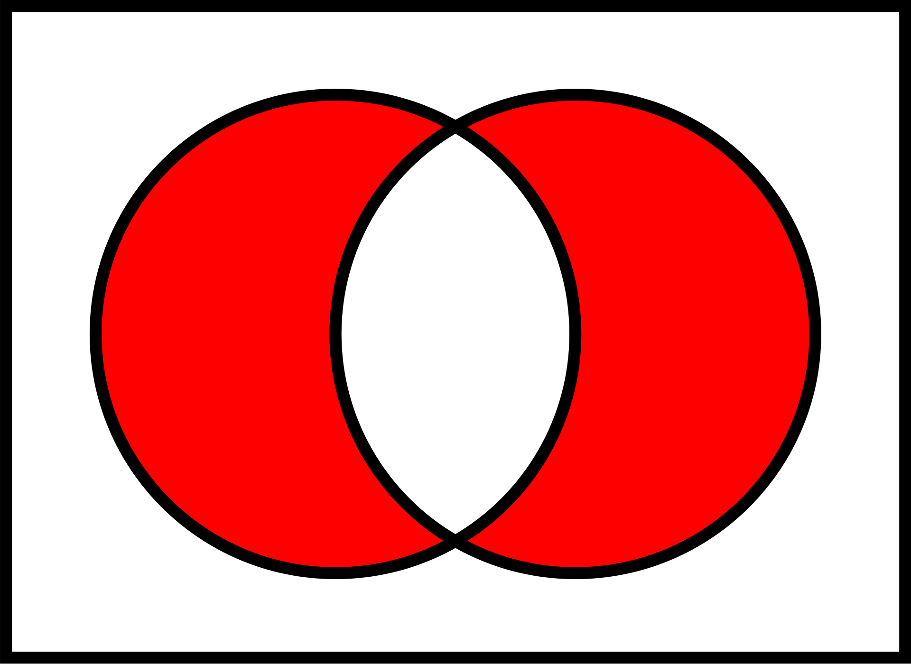

# 2. Переменные, Булева алгебра, двоичная арифметика

## Переменные и типы данных.

Результат работы программиста - программный код, текст. Код состоит из инструкций компьютеру, что, как и в какой последовательности выполнить. Все эти инструкции следуют определенной цели, которую видит программист. Начальные, промежуточные и конечные данные каждого действия или комплекса действий сохраняют в переменных, у которых есть определенный тип данных. Для того, чтобы понимать весь этот процесс, мы наше знакомство с программированием начнем с нескольких терминов:

**Переменная** - данные, которые хранятся в оперативной памяти и имеют имя и тип. Проще ассоциировать с подписанным контейнером, в котором что-то лежит.

**Тип данных** - характеристика набора данных, которая определяет возможные значения этого набора, ряд допустимых операций, которые можно предпринимать с этими данными, и способ хранения этих данных в памяти.

*Пример из реальной жизни:*
>Коробки с фруктами, на которых написано "Фрукты". Они занимают определенное место, у нее есть название и все примерно ориентируются, что можно сделать с содержимым этой коробки. Коробки с фруктами содержат фрукты. Их можно открыть, фрукт можно съесть, можно разрезать, можно почистить, можно приготовить салат и так далее.
>Ящик с надписью "Посуда" при переезде. Ясно, что внутри хрупкое и бьющееся, ясно, как это транспортировать и когда распаковывать. 

В программировании типов данных много, и в различных языках они различаются. Тем не менее, рассмотрим их общие виды и характеристики. Разобравшись с этим, мы сможем классифицировать любой незнакомый нам тип данных.


**Примитивами** называют типы данных, которые состоят из одного элемента. Синонимы к этому определению - **скалярные**.

**Структурными** можно назвать типы данных, которые состоят из элементов других типов данных. Название - синоним: нескалярные, аггрегатные.

Говоря проще, примитивы - простейшие типы данных, которые неделимы, тогда как структурные состоят из набора структурных или примитивных типов.

### Скалярные типы данных или примитивы.

Во многих, если не во всех языках программирования высокого уровня встречаются следующие примитивы:

- **Булевы или логические данные.** Переменная этого типа может иметь только два значения - Правда и Ложь (**True, False**). Часто эти параметры интерпретируются соответственно как 1 и 0. Используется повсеместно для получения ответов на различные вопросы и дальнейшего выбора варианта действий.
- **Целые числа.** Переменные такого типа содержат целое число. В зависимости от языка программирования и выбранного подтипа целочисленных данных различаются диапазоном значений и воможностью работы с отрицательными числами.
- **Числа с плавающей точкой** или вещественные числа. Сюда входят как целые числа, у которых дробная часть есть, но считается пустой, так и дробные. В программном виде чаще всего такие числа записываются как `x = a * 10^b`, т.е. через дробное десятичное число **a**, умноженное на 10 в степени **b**. В математике это выглядит как `1.2*10^3`, в программировании степень числа 10 пишется через экспоненту, т.е. `1.2e3`. Например, расстояние от Земли до Солнца составляет `1.496 · 10^11` , или 1.496e11.
- **Комплексные числа** - числа вида `x + iy`, где `i` - корень из минус единицы. Необходимо для ряда математических действий и изысканий, обычному программисту может быть нужно довольно редко.
- **Отсутствие значения и типа** - особый тип данных, который означает ничего, пустое место. Отличается от нуля, пустой строки или пустого массива. В разных языках называется по-разному, например **null, none, nan**.
- **Строки** - Строки принято относить к примитивам, хотя они и состоят из символов.

### Структурные типы данных.

Структурные типы данных, которые можно встретить в различных языках:

- Массивы
- Кортежи
- Словари
- Множества
- Функциональные типы данных
- Записи

Эти типы данных мы расмотрим позже более подробно.

### Мутабельность (mutable)

Так же типы данных могут быть изменяемыми или **мутабельными**, и неизменяемыми (**иммутабельными**). Знакомясь с новыми типами данных конкретного языка разумно было бы выяснять, можно ли его менять, или он иммутабелен, т.е. значение его останется тем же, каким было создано, и можно либо работать с тем значением, что есть, либо создавать новое значение для него.

Те же строки, к примеру, могут быть неизменяемыми. Это значит, что в переменную можно записать строку, но изменить ее после этого будет невозможно. Однако, будет возможность записать в эту переменную другую строку, в том числе и измененную исходную строку.

### Булевы переменные

Переменная типа `bool` может содержать только два значения: **True** или **False**, при чем это не строки, не числа, а именно понятия ложь и истина.

Для работы с булевыми переменными существует булева алгебра.


### Булева алгебра (логические операторы)

Существуют следующие логические операторы:

* and  - И
* or   - ИЛИ
* xor  - Исключающее ИЛИ (подключается отдельно)
* not  - НЕ

not означает НЕ, и, будучи поставленным перед типом bool, меняет его значение на обратное, т.е. **`not True`** становится **`False`**,**`not False`** становится **`True`**

Далее приведена таблица, демонстрирующая работу операторов:

| Операторы    | 0 to 0| 0 to 1| 1 to 0 | 1 to 1|
|--------------|:-----:|:-----:|:------:|:-----:|
| and или `&&` |   0   |   0   |    0   |   1   |
| or           |   0   |   1   |    1   |   1   |
| xor          |   0   |   1   |    1   |   0   |


### Оператор условия "если" (if)

Во многих, если не во всех языках программирования существуют условия вида **если - иначе, если - иначе**. Код выглядит примерно следующим образом:

```
если (X mod 2 == 0):
    число нечетное
иначе:
    число четное
```
Операция mod - операция взятия остатка от деления.

Есть различные варианты использования оператора `если`: просто `если`, с использованием `иначе` и с любым количеством `иначе, если` между `если` и `иначе, если`.

### Тернарные операторы

Во многих языках программирования (С++, Java, PHP...) существуют тернарный оператор, т.е. специальный оператор условия, который возвращает один из двух результатов, в зависимости от того, выполняется его условие или нет. Выглядит он так:

```
сообщить (Время суток = 'утро') ? "Привет!" : "Пока!";
```

Тернарные операторы часто применяются, когда варианта всего два, так как такая запись короче аналогичного действия с `если`. Однако, к сожалению, можно встретить связку нескольких `если` и тернарных операторов, которую совершенно невозможно прочесть. Другими словами, это не необходимая вещь в языке и она может стать причиной нечитаемого текста.

### Множества

Множество или сет (set) по сути - "контейнер", содержащий не повторяющиеся, уникальные элементы в случайном порядке.  В этом определении упомянуты две основные особенности сетов - **уникальность** и **отсутствие сортировки**.

Уникальность -  сет содержит только уникальные элементы, если добавлять в него дубликаты - они не добавляются, если перевести какую-то переменную с неуникальными данными в сет - дублирующие элементы будут удалены.

Отсутствие сортировки - элементы в сете находятся в неком хаотичном порядке.

Множества поддерживают перебор всех элементов (итерацию), добавление и удаление элементов, но в силу отсутствия сортировки не поддерживают индексацию и срезы.

Создание множеств:

```
м1 = множество([1, 2, 3, 4, 5, 6])
м2 = множество([5, 6, 7, 8, 9])

a = [1, 2, 3, 4, 5, 6, 5, 4, 3, 2]

вывести a
[1, 2, 3, 4, 5, 6, 5, 4, 3, 2]

м3 = множество(a)

вывести м3
([1, 2, 3, 4, 5, 6])
```

Множества поддерживают операции вычитания, объединения, пересечения:

```
м1 = множество([1, 2, 3, 4, 5, 6])
м2 = множество([5, 6, 7, 8, 9])
м1 - м2 # Разность множеств
([1, 2, 3, 4])

м1 | м2 # Объединение множеств
([1, 2, 3, 4, 5, 6, 7, 8, 9])

м1 & м2 # Пересечение множеств
([5, 6])
```

Можно добавить элемент в множество и удалить из множества элемент. В качестве параметра выступает сам элемент, поскольку индексов в множестве нет.

```
м1.добавить(7)

вывести м1
([1, 2, 3, 4, 5, 6, 7])

м1.удалить(1)

вывести м1
([2, 3, 4, 5, 6, 7, 8])
```


### Диаграммы Эйлера-Венна



Множества принято визуализировать при помощи диаграмм Эйлера-Венна.
В том числе и булеву алгебру удобно и просто понять на примере таких диаграмм:

**AND, и в том и в том случае истина:**


**OR, или в том или в том случае истина:**


**XOR, истина или в том, или в другом случае, но не в обоих случаях сразу.**



### Практические задания на диаграммы Эйлера-Венна

**1. Разместить в кругах:**

- Числа целые
- Числа положительные
- Числа отрицательные
- Числа простые

**2. Нарисовать круги для заварного кофе:**

- эспрессо
- американо
- каппучино
- латте
- доппио

**3. Решить задачу:**
Все женщины - дочки, но не все женщины матери. Некоторые матери - бабушки. Нарисуйте внучек!

**5. Разместить в кругах:**
Зайцы четвероногие, млекопитающие, хордовые, живородящие. Лебеди птицы, яцекладущие, хордовые. Утконосы четвероногие, яйцекладущие, млекопитающие.

**5. Разместить в кругах:**
Всего Студентов 2000

Программистов 1500

Дизайнеров 300

Менеджеров 200

Фронтендщиков 1000

Бекендщиков 500

PHP программистов 200

JS программистов 1100

Java программистов 100

## Системы счисления

И напоследок немного поговорим о системах счисления, это нам неоднократно пригодится в понимании некоторых концепций программирования в будущем.


Для лучшего понимания программирования будет не лишним уметь читать числа разных систем счисления и переводить из одной в другую.


## Полезные ссылки

Доп. статьи:

[Круги Эйлера](https://blog.tutoronline.ru/krugi-jejlera)

[Математическая логика](http://ya-znau.ru/znaniya/zn/135)

[Решания задач при помощи кругов Эйлера](https://sibac.info/shcoolconf/science/xvii/42485)

[Тест на логическое мышление](http://testoteka.narod.ru/pozn/1/10-on.html)

[Онлайн создание диаграмм](https://creately.com/ru/%D0%9A%D0%BE%D0%BD%D1%81%D1%82%D1%80%D1%83%D0%BA%D1%82%D0%BE%D1%80-%D0%B4%D0%B8%D0%B0%D0%B3%D1%80%D0%B0%D0%BC%D0%BC-%D0%92%D0%B5%D0%BD%D0%BD%D0%B0-%D0%BE%D0%BD%D0%BB%D0%B0%D0%B9%D0%BD)

## Домашка

[Домашнее задание](hw2.md)
