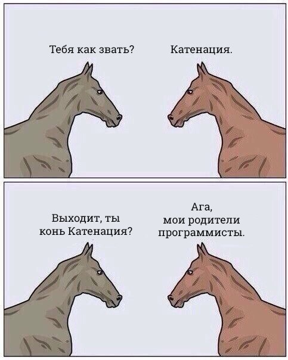

# 3. Перечисляемые типы данных, циклы, основы функций.


## Изменяемые и неизменяемые типы данных

Как мы уже обсуждали, существуют изменяемые (**mutable**) и неизменяемые (**immutable**) типы данных.

Ранее рассматривался целочисленный тип данных, который, зачастую, является неизменяемым. Так же неизменяемыми могут являться типы данных **tuple** (кортеж) и **string** (строка).

Что значит неизменяемыми? Значит, что изначально созданную строку мы изменить не можем. Если же кажется, что объект одного из перечисленных данных изменился - значит теперь имя объекта просто указывает на новую область в памяти с новым объектом.

## Строки

В некоторых языках есть разница между одинарными и двойными кавычками, в некоторых есть, а случаются еще и тройные кавычки двух видов, и все это - для создания строк. Тем не менее здесь нет ничего сложного, основное правило при создании строки: каким видом кавычек вы начали создавать строку, таким и заканчинвайте.

```
s = 'asdf'
```
Вот типичное создание строки.


Простейшие арифметические операции сложения и умножения часто доступны и со строками. Сложение двух строк называется **конкатенацией**.



 В некоторых языках существует умножение строки на число и взятие конкретного элемента строки по его индексу. Индексы во всех последовательностях в программировании считаются от нуля. Некоторые ЯП позволяют работать по отрицательному индексу - отсчитываем от конца последовательности назад.


## Массивы, списки, кортежи

В различных ЯП существуют различные типы последовательностей. Те типы, в которых у каждого элемента есть порядковый номер, называются **массивами**.

Массив может быть **гомогенным**, т.е. содержащим данные только одного типа, и **гетерогенным**, т.е. содержащим разнотиповые данные. 

Встречаются языки, содержащие оба типа, встречаются и те, в которых возможен только один тип массива.

В зависимости от размерности массива различают **одномерные и многомерные** массивы.


Также массивы могут быть изменяемыми, т.е. **мутабельными**, и неизменяемыми, т.е. **иммутабельными**.

### Операции с массивами

Создаются массивы при помощи:

- перечисления элементов сразу при создании
- добавления элементов в цикле после обработки какого-то источника или вычислений
- из других типов данных, например, из строк
- специальными генерирующими функцями.

Помимо создания массивов, классическими операцими с массивами являются:

- добавление элементов в начало, конец или любое место массива (если он мутабелен)
- взятие элемента по индексу
- взятие подмассива
- удаление элемента или подмассива
- сортировки различных видов

Чаще всего с массивами работают при помощи различных циклов, либо по количеству элементов в массиве, либо перебирая их поэлментно.

### Словари

Есть отдельный вид массивов, который называют ассоциативным массивом или словарем. Хэш - еще один синоним для такого типа данных. Это тоже составной, структурный ип данных, но ключом здесь могут выступать не только числа, но и строки, а в некоторых языках - и дугие типы данных. Значением, как правило, могут выступать все существующие типы данных.


Существует несколько вариантов создания словарей, и они пожжерживают большинство операций, которые придут на ум программисту: 

- расширение одним элементом
- расширение словарем
- удаление элемента по ключу
- взятие всех ключей
- взятие всех значений
- ... и многие другие действия.

### Циклы

Важнейшим элементов многих ЯП являются циклы.

Для их понимания важны следующие термины:

**Тело цикла** - действия, которые выполняются в рамках цикла. Обычно заключены в фигурные скобки или их аналоги и расположены ниже и со сдвигом, в случае цикла с постусловием - выше и со сдвигом.
**Итерация** - один проход тела цикла.

Распространены следующие варианты циклов:

1. Цикл с предусловием. Чаще всего это **while**. Как правило, такой цикл проверяет условие, и если оно истинно, выполняет ряд действий, находящихся в теле цикла. Затем снова проверяет условие, выполняет те же действия, и так до тех пор, пока условие не станет ложно.

2. Цикл с постусловием - встречается и используется несколько реже.  Чаще всего называется **do while** Очень похож на первый вариант, но всегда выполняет одн итерацию цикла до проверки условия. Проще говоря, сначала делает все действия один раз, потом проверяет условие, и выполняет эти действия снова и снова, пока условие истинно. Если эе условие изначально ложно, цикл с постусловием сработает один раз, тогда как цикл с предусловием - ни разу.

3. Цикл со счетчиком. Чаще всего это **for**. Исользуется для того, чтобы повторить некоторый набор действий - тело цикла - определенное количество раз. Как правило, в самом заголовке цикла определяется переменная, условия ее изменения и условие проверки, не достигла ли эта переменная граничного значения, когда цил должен прекратить выполняться.

4. Цикл перебора. Варианты названий: **for, foreach, each**. Служит для того, чтобы поэлементно работать с массивами или другими перечисляемыми типами данных.


### Функции

Функциями называются отдельные блоки кода. Зачастую у этих блоков есть имена, они выполняют определеные действия и возвращают результат. Причины, по которым программист может выдеть часть кода в отдельную функцию, обычно следующие:

- этот код появляется и выполняется в разных местах программы
- этот код имеет четкое назначение
- этот код имеет довольно сложную логику

Уже буквально на следующем уроке мы познакомимся с Python, через урок-другой познакомимся с функциями и начнем как понимать существующие функции, так и писать свои собственные.


## Домашка

[Домашнее задание](hw3.md)

